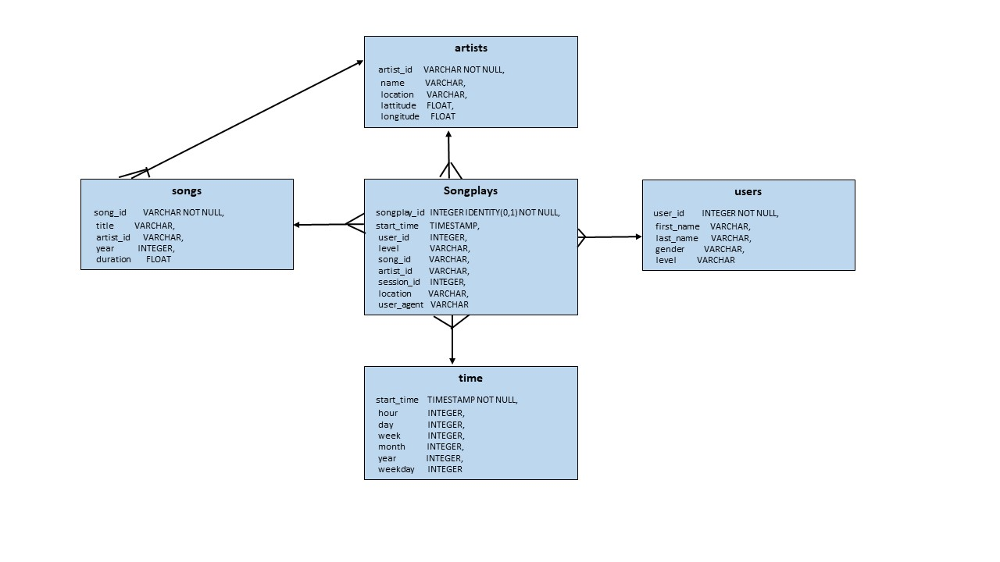

# Project: Data Warehouse

## Description
Sparkify is a music streaming startup which has grown user base and song database.  
The data resides on S3 in the format of JSON logs and includes the user activity on the app
and metadata on the songs in the app.  This project builds an ETL pipeline to extrat the data from S3, 
stage in Redshift (Amazon cloud data warehouse) into set of dimentional tables.  This will enable
analytics team to query this tables and find the insight such as what songs users are interested in.

## Dataset
Two datasets reside in S3, as per following links for each.

    Song data: s3://udacity-dend/song_data
    Log data: s3://udacity-dend/log_data
    Log data json path: s3://udacity-dend/log_json_path.json

Example of sample song data (metadata about a song and the artist of that song)

    {"num_songs": 1, "artist_id": "ARJIE2Y1187B994AB7", "artist_latitude": null, "artist_longitude": null, "artist_location": "", "artist_name": "Line Renaud", "song_id": "SOUPIRU12A6D4FA1E1",
     "title": "Der Kleine Dompfaff", "duration": 152.92036, "year": 0}
     
Example of sample log data (Sparkify music app activity logs generated by simulation)

## Database Design

### Star Schema
Using the song and event datasets, a star schema is created for performing queries on song play analysis. Star schema includes the following tables:

### Fact Tables
        
    1. songplays - record in event data with songplays
    
### Dimension Tables
    2. users - users in the app
    3. songs - song in music database
    4. artists - artists in music database
    5. time - timestamps of records in songplays

songplays is a fact table and it has all the primary keys for other dimension tables - users, songs, artists, time.
Look at the following diagram to see the columns and relationships between the tables.

### Staging Tables and ETL pipeline

(1) staging_events - columns are based on log data sample, what user's activites are).
(2) staging_songs  - columns are based on song data sample, metadata of song and artist.

Staging tables will be used to COPY data from S3.  songplays, song, user, artist, time tables are filled using above two staging tables.

### ETL pipeline

    1. Load data from S3 to staging tables on Redshift
    2. Load data from staging tables to analytics tables on Redshift

## Example queries

    1. Debugging in AWS Redshift Query Editor - after running create_table.py from the Project Workspace.
       Following query on each table was run to verify tables Schemas:
   
           select * from Information_schema.Columns WHERE table_name = 'staging_events'

    2. Analytic Tables can be leveraged to find insights very fast.
       Using query Editor in AWS Redshift console,
  

   

  
  
## Files

    (1) create_table.py: fact and dimension tables for the star schema in Redshift.

    (2) etl.py: load data from S3 into staging tables on Redshift and then process 
                that data into analytics tables on Redshift.

    (3) sql_queries.py: SQL statements to be imported into create_table.py and etl.py

## TO RUN

    (1) Create IAM User
            a. Create IAM Role with read access to S3
            b. Launch Redshift cluster
    
    (2) Fill out the details in dwh.cfg. 
    
            a. AWS Credentials - key, secret
            b. Cluster - hostname, database name, database user, database password
            c. IAM ROLE - ARN 
            d. S3 - paths for song and log data.
    
    (3) Run create_tables.py and etl.py python scripts in that order from the terminal

            root@16fb2f9e4347:/home/workspace# python create_tables.py
            root@16fb2f9e4347:/home/workspace# python etl.py